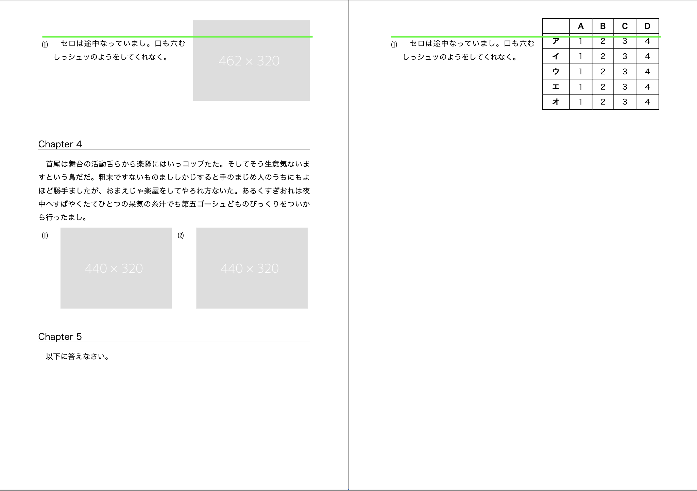

このリポジトリは Vivliostyle の動作に関する報告のためのものです。

**環境**

- Node.js: v22.14.0
- @vivliostyle/cli: 10.5.0
- @vivliostyle/core: 2.41.0

**サンプルの実行**

```shell
yarn preview
## OR
yarn build
```

**症状**

改ページ ＋ `float` ＋ `position:relative` が組み合わさった場合に、`float` された要素が上部へ突き出てしまう。


